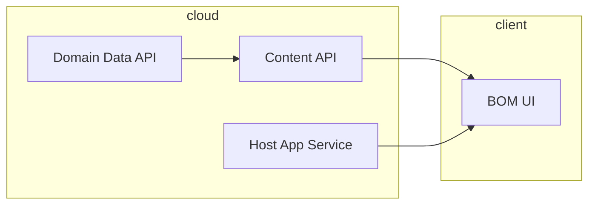
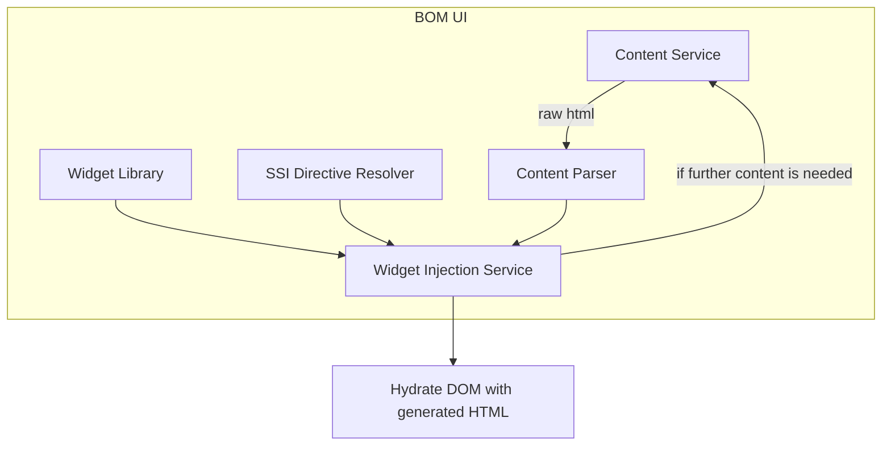

# Server Side Includes + µ Frontends POC

This POC is inspired from npm dependency [html-react-parser](https://www.npmjs.com/package/html-react-parser)

## Architecture

### BOM UI

Bill of Materier UI package contains all the essesntial building blocks for an app to be built for any org, it would have entire UI library and widgets lazy-loaded or included into the primary bundle as-per-usage

BOM would only expose following function

```tsx
interface BootstrapFn {
    (rawHtml: string, rootElementNode: Element);
}
```

uasge of this function looks like following in the **Host App**

```tsx
bootstrap(`<h1>Hello World</h1>`, document.getElementById("root"));
```

this would create the react tree using library [html-react-parser](https://www.npmjs.com/package/html-react-parser) and place it inside element with id **"root"**

### API

Content API would expose subsequent HTML views that can be accessed using following custom tag anywhere in the template.

```html
<view include="{path}" />
```

example:

```html
<view include="/api/content/dashboard" />
```

### Diagram




